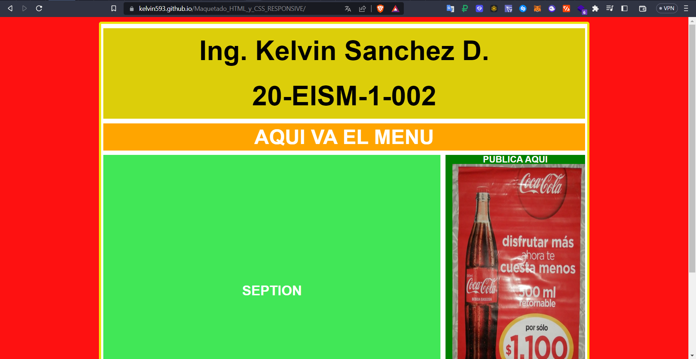

# Maquetado_HTML_y_CSS_RESPONSIVE
Maqueta básica en HTML y CSS con diseño RESPONSIVE

# MAQUETA_BASICA_HTML_Y_CSS
MAQUETA_BASICA_HTML_Y_CSS RESPONSIVA
## Práctica universitaria de HTML y CSS, una Maqueta Basica con Diseño Adaptativo y Reponsive.

## Quieres ver mi Web-Entra en este enlace: https://kelvin593.github.io/Maquetado_HTML_y_CSS_RESPONSIVE/

### Captura de Pantalla:

